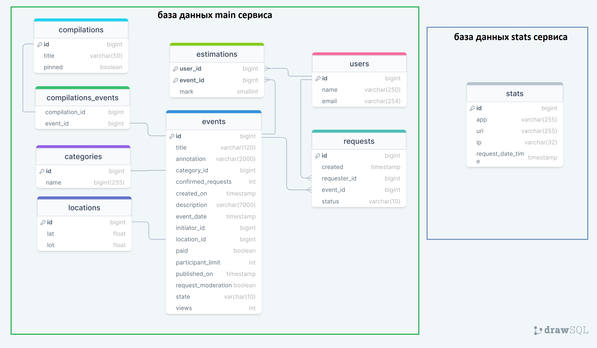

# java-explore-with-me

[3-й этап дипломного проекта](https://github.com/yrMajesty/java-explore-with-me/pull/7)

__Цель:__ Итоговый (дипломный) проект по окончанию обучения по курсу Java-разработчик на Yandex Практикуме.

__Идея проекта:__ Свободное время — ценный ресурс. Ежедневно каждый планирует как его потратить — куда и с кем сходить. 
Сложнее всего в таком планировании поиск информации и переговоры. Нужно учесть много деталей: какие намечаются мероприятия, 
свободны ли в этот момент друзья, как всех пригласить и где собраться.
Написанное приложение — афиша, в которой можно предложить какое-либо событие от выставки до похода в кино и собрать
компанию для участия в нём.

__Краткое описание:__ Проект с микросервисной архитектурой написан на языке Java с использованием Spring Boot фреймворка, Jpa(Hibernate), 
объектно-реляционной базы данных PostgreSQL.

## Технологии
- Java 11
- Spring Boot
- JPA
- Hibernate
- Lombok
- PostgreSQL
- Maven

## Приложение состоит из двух сервисов
1. Основной сервис (main-service)
Содержит основную логику работы приложения и разделен на части по уровням доступа:
•	публичная будет доступна без регистрации любому пользователю сети;
•	закрытая будет доступна только авторизованным пользователям;
•	административная — для администраторов сервиса.
2. Сервис статистики (stats-service)
Хранит количество просмотров и позволяет делать различные выборки для анализа работы приложения.

## Возможности приложения
### Операции с пользователями:
__Для администраторов:__
- Создать пользователя
- Найти пользователей по списку указанных id пользователей

### Операции с категориями событий
__Для администраторов:__
- Создать/удалить/обновить категорию

__Для всех пользователей:__
- Найти категорию по id
- Получить список категорий

### Операции с событиями
__Для зарегистрированных пользователей:__
- Добавить событие
- Найти список событий, созданных пользователем
- Найти событие пользователя по id
- Обновить информацию о событии, созданном пользователем
- Получить список заявок на событие, созданное пользователем
- Одобрить или отклонить заявки из списка для определённого события 

__Для всех пользователей:__
- Поиск событий по задаваемым параметрам
- Поиск опубликованного события по id

__Для администраторов:__
- Поиск событий по разным параметрам
- Обновление события

## Операции заявками на участие в событии
__Для зарегистрированных пользователей:__
- Создать заявку
- Получить список собственных заявок
- Отклонить заявку (для инициатора события)

## Подборки событий
__Для администраторов:__
- Создать/удалить/обновить подборку

__Для всех пользователей:__
- Найти подборку по id
- Получить список подборок

## Операции с рейтингом
__Для зарегистрированных пользователей:__
- Поставить оценку события (только для участника)
- Удалить собственную оценку

__Для всех пользователей:__
- Получить событие с рейтингом

## Схема базы данных основного сервиса и сервиса статистики:

## Запуск приложения
- Командой «docker-compose up» (Для запуска через докер);
- С помощью IntelliJ IDEA:  
Main-service: main-service\src\main\java\ru\practicum\mainservice\MainServiceApp -> "run";   
Stats-service: stats-service\stats-server\src\main\java\ru\practicum\statsserver\StatsServerApplication -> "run"
